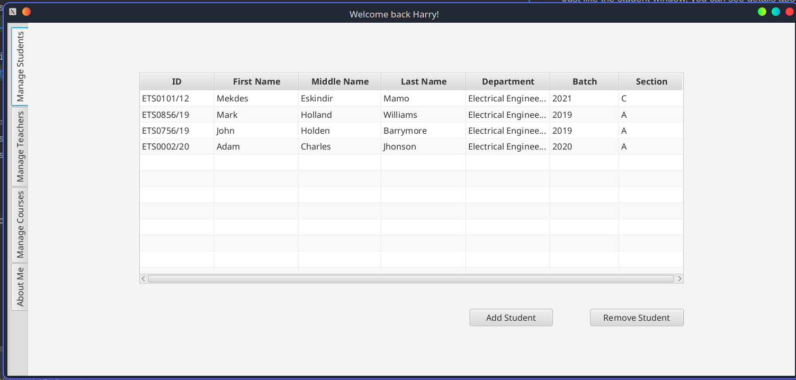

College Manager
===
Technologies and Frameworks used:

| Java                                                                            | SQLite                                                                     | JavaFX                                                                                                                                  | JUnit                                                          | Maven                                                                   | Java FX Scene Builder                                                   |
|---------------------------------------------------------------------------------|----------------------------------------------------------------------------|-----------------------------------------------------------------------------------------------------------------------------------------|----------------------------------------------------------------|-------------------------------------------------------------------------|-------------------------------------------------------------------------|
|  |  |  |  |  |  |

 
This app lets members of a university/college access grades and courses. It lets:

* Students view the courses they take and the scores they got from the courses.
* Teachers to see the students they teach and modify the scores that they are given.
* College deans and administrators to view, add, and remove students, courses and teachers.

### Logging In
On the login page, the user can choose to log in as a student, teacher or an admin

### Student
You can use __ETS0856/19__ as the student's ID with password __blue-berries!__. This student is stored in the sample 
database. The passwords are hashed in the SHA256 algorithm, they are not stored in plain text.

After logging in, you will be presented with the dashboard which lets you choose a semester and view the courses 
given in that semester.

In the _Grades & Scores_ tab, the student can view the score he got for each course on every semester.
By selecting a course, you can view the student's quiz, test and assignment scores for that course.

On the last tab, you can view the student's detailed information about them

 

### Teacher
To log in as a teacher, you can use __robert_m__ as username and __protract_handle__ as the password.

Once logged in, you will be presented into the manage scores tab. Here you can select your students and fill in 
their scores. By clicking the _Update Score_ button, you can save your changes to the database.

Just like the student window, you can see details about the teacher in the _About Me_ tab.

 

### Admin
Administrators of the university/college can manage the courses given, the teachers and the students learning at the 
university.

To log in as an administrator, use the username __harry_s__ and password __rearrange-stall__

Once logged in, you will be presented with the default tab, the manage students tab

You can view the students enrolled in the university, add new students and remove existing students.

By clicking the _Add Student_ button, you can fill out the information of the new student in this window:

You can remove a student by clicking the _Remove Student_ button. It will display a warning message before clearing 
the student from the database:

 

Moving on to the next tab, _Manage Teachers_ you can view the teachers currently teaching in the university.

By clicking the _Add Teacher button, you can fill out the information of the new teacher in this window:

You can remove a teacher by clicking the _Remove Teacher button. It will display a warning message before clearing
the teacher from the database:

 

The third tab lets you manage the courses given in the university.

Similar to adding a student, you can add a course and fill its details by clicking the _Add Course_ tab.

You can also remove an existing course by selecting it and clicking the _Remove Course_ button.

On the last tab, _About Me_ you can see the details of the administrator.

